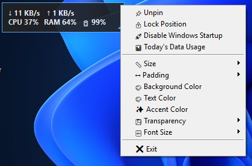

# 🚀 Material Glass Speed Meter

A lightweight and modern floating Windows network speed and system monitor.



## ✨ Features

- ⬇️ Real-time Download Speed
- ⬆️ Real-time Upload Speed
- 🧠 CPU Usage
- 💾 RAM Usage
- 🔋 Battery Percentage
- 📊 Today's Download / Upload Data
- 📌 Pin / Unpin
- 🖱️ Drag to Move
- ↘️ Drag to Resize
- 🔒 Lock Position
- 🚀 Windows Startup
- 🎨 Custom Background Color
- 🎨 Custom Text Color
- ✨ Custom Accent Color
- 🌫️ Transparency Control
- 📏 Multiple Widget Sizes
- ↔️ Padding Control
- 🔤 Font Size Control
- 💾 Settings Saved Automatically
- 📅 Daily Data Usage Reset

## 🖥️ Screenshot

The widget provides a compact floating monitor for Windows.

## 📦 Requirements

- Windows 10 / Windows 11
- Python 3.13+ (for running from source)

## 🔧 Installation

Install the required packages:

```bash
pip install psutil